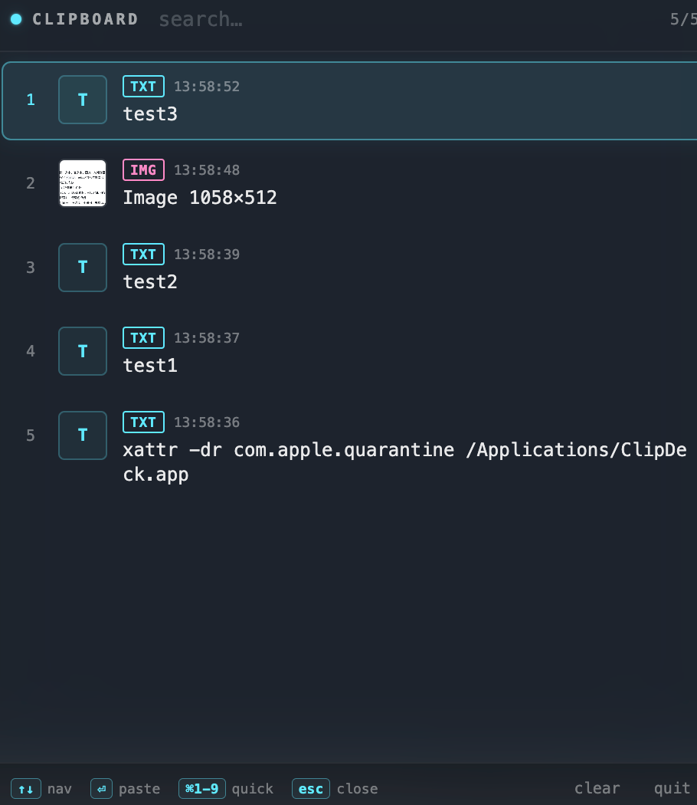

# ClipDeck

macOS 剪贴板历史小工具。按 <kbd>⌘</kbd><kbd>⇧</kbd><kbd>V</kbd> 在任何 app 里调出最近 100 条复制记录。

> [English →](README.md)



## 功能

- 📋 自动捕获：文本、富文本、图片、文件路径
- ⌨️ 全局快捷键 <kbd>⌘</kbd><kbd>⇧</kbd><kbd>V</kbd>，面板从鼠标位置弹出
- 🔍 实时搜索历史内容
- 🎯 <kbd>⌘</kbd>+<kbd>1</kbd>–<kbd>9</kbd> 秒选最近 9 条
- 🖥️ 菜单栏 app，无 Dock 图标，~150 MB 内存
- 🕶️ 毛玻璃 UI 跟随系统明暗主题，青蓝色点缀
- 💾 仅内存存储 — 不写磁盘、不联网、关掉 app 即清空

## 安装

### 从 Release 下载（推荐）

1. 打开 [Releases 页面](https://github.com/zc9632/clip-deck/releases)，下载最新的 `ClipDeck-<版本号>-arm64.dmg`（Apple Silicon）或 `ClipDeck-<版本号>.dmg`（Intel）。
2. 双击 `.dmg`，把 **ClipDeck** 拖到 `/Applications`。
3. **首次启动 — 绕过 Gatekeeper。** ClipDeck 没花 $99 买 Apple 开发者签名，所以 macOS 会拦一下。**只需做一次：**

   **方式 A（图形界面）**：在 Finder 里 **右键** 点 `ClipDeck.app` → **打开** → 弹窗里再点一次 **打开**。

   **方式 B（终端一行）**：
   ```bash
   xattr -dr com.apple.quarantine /Applications/ClipDeck.app
   ```
   然后双击即可。

4. 看右上角菜单栏出现 **⌘V** 字样 = app 已运行。在任何地方按 <kbd>⌘</kbd><kbd>⇧</kbd><kbd>V</kbd> 召唤面板。

> ℹ️ 为什么有警告？ Apple 那个免警告证书要 $99/年。作为开源早期版本暂时不签。源码全在仓库里，可自行审计或自己 build。

## 使用

| 操作 | 按键 |
|---|---|
| 打开 / 关闭面板 | <kbd>⌘</kbd><kbd>⇧</kbd><kbd>V</kbd> |
| 移动选中 | <kbd>↑</kbd> <kbd>↓</kbd> |
| 复制选中项 | <kbd>⏎</kbd> |
| 秒选前 9 条 | <kbd>⌘</kbd>+<kbd>1</kbd>…<kbd>9</kbd> |
| 不复制直接关 | <kbd>Esc</kbd> |
| 搜索 | 直接打字 |

按 <kbd>⏎</kbd> 后，所选条目会写入系统剪贴板并关闭面板。回到目标 app 用 <kbd>⌘</kbd><kbd>V</kbd> 粘贴即可。

## 自己 build

```bash
git clone https://github.com/zc9632/clip-deck.git
cd clip-deck
npm install
npm start          # 开发模式
npm run dist       # 同时打 arm64 和 x64 的 .dmg / .zip
```

产物在 `dist/`。

## 路线图

- [ ] 可选持久化（SQLite，默认关）
- [ ] 按 app 过滤
- [ ] 钉选条目不被淘汰
- [ ] 代码签名 + 自动更新
- [ ] Windows / Linux 版本（需要协作者）

## 隐私

ClipDeck 在运行期间会读取系统剪贴板内容。**不写磁盘、不联网。** 历史只存在内存里，关掉 app 即清空。

## 许可

MIT © Zhaochang. 详见 [LICENSE](LICENSE)。
